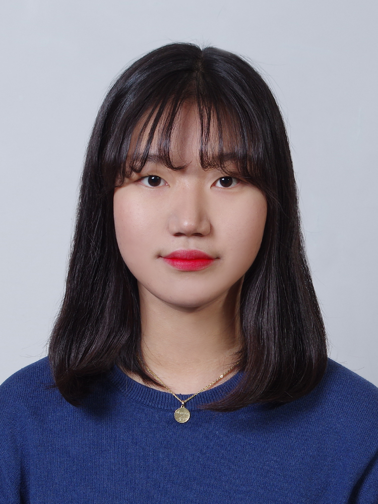

# 한림대학교 소프트웨어융합대학
---

장다연 

---

소속 : 소프트웨어융합대학    
전공 : 미정

관심분야    
* 컴퓨터구조
* 웹
* 앱

프로그래밍 언어 스킬
1. C
2. Java
3. Python
4. JavaScript

--------------

2021년도 1학기 강의 과목
|과목|담당교수|학점|
|---|---|---|
|컴퓨팅사고와문제해결-융합|이은주|2|
|Java 프로그래밍1|김진환|3|
|소프트웨어세미나1|김동회|1|
|[삶의질문]삶의큰질문:사랑|김양선|3|
|영어독해연습|김설|3|
|오디세이세미나1|송성호|1|
|이산구조론|김유섭|3|
|지식재산입문|정효석|3|

------------------

2021 여름방학 계획
1. 운전면허 따기
2. 일본어 배우기
3. 영어회화 하기
4. 자바 복습하기
5. 파이썬 복습하기
6. 혼자 여행가보기
7. 알바 해보기
8. 하계워크샵 가기

github address : [jangdayeon][github]

[github]:http://github.com/jangdayeon
